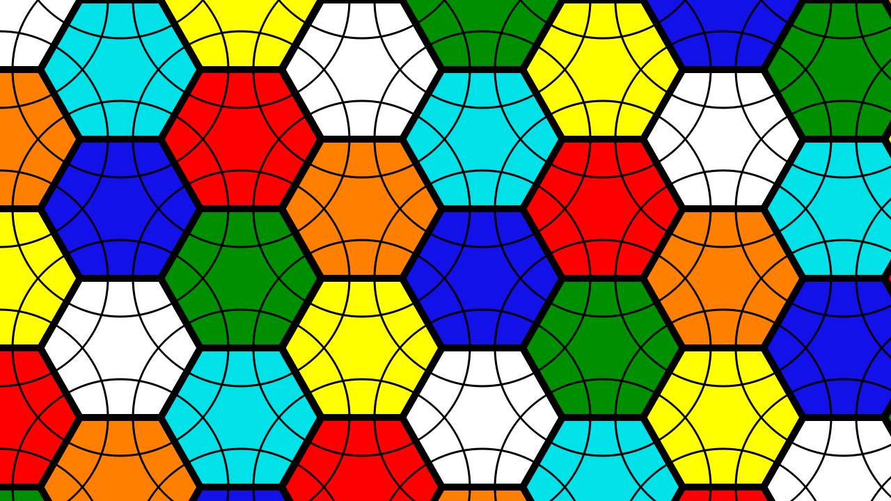
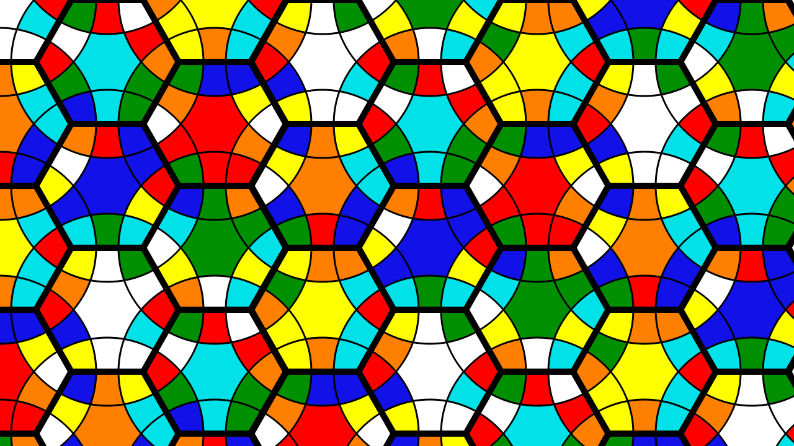
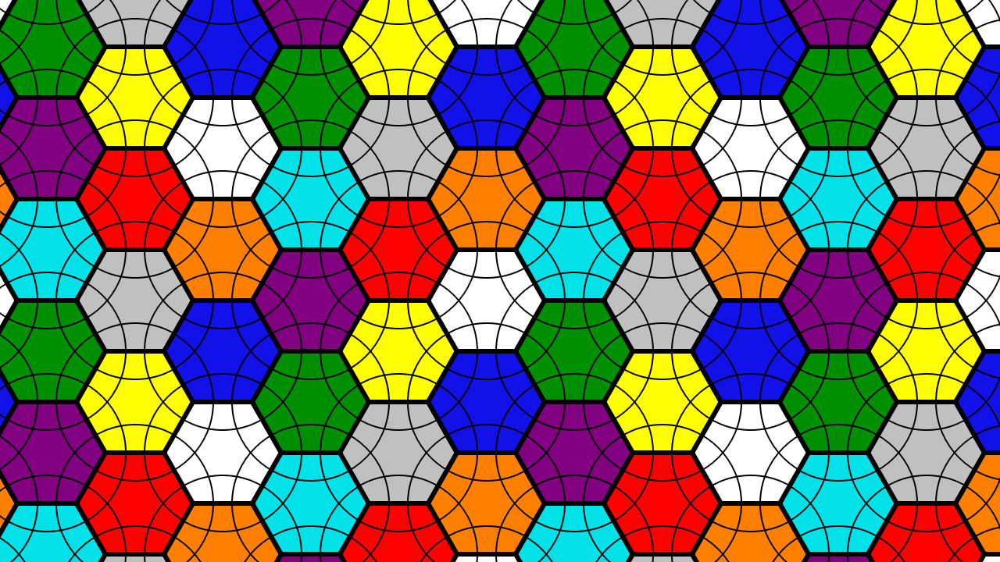
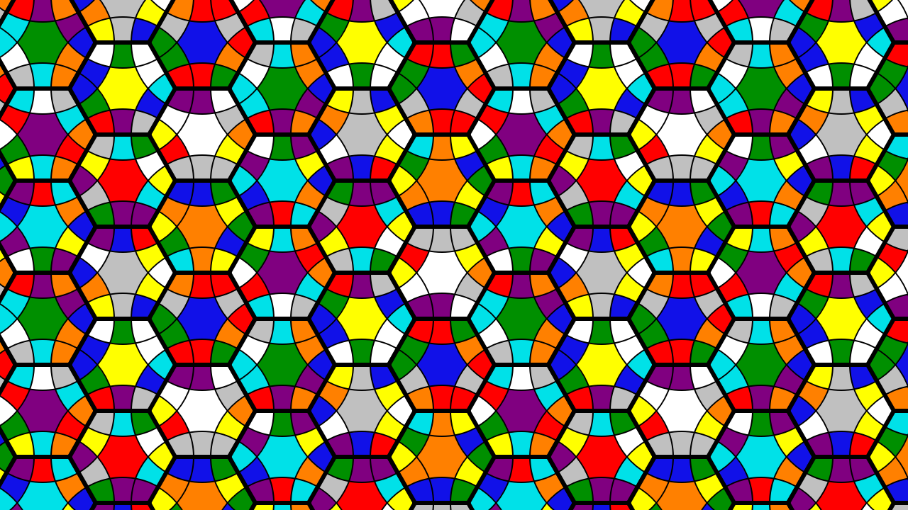

# MagicTile

MagicTile is a playable desktop puzzle set on an infinite periodic plane of
hexagonal faces. Its core idea is similar to a Rubik's Cube: the player rotates
a selected face together with a surrounding ring of pieces and tries to return
every face to a single color.

Key features:

- Torus and Klein-bottle infinite boards with exact animated 60-degree turns.
- A complete game loop with multiple scramble lengths, move counting, and
  automatic solved-state detection.
- Mouse-driven turns, panning, and zooming.
- Animated undo and redo.
- Ten persistent face-relative macro slots with normal and reverse playback.
- Setup Moves that can be recorded and unwound after running a formula.
- Portable game saves and human-readable configuration.

## Board modes

The board looks infinite, but it is built by repeating a small set of logical
faces. The selected mode determines what happens to the pattern when it crosses
the boundary of that set.

| | Torus mode | Klein bottle mode |
| --- | --- | --- |
| Logical faces | 7 | 9, arranged as a 3-by-3 block |
| Vertical repetition | Same orientation | Same orientation |
| Horizontal repetition | Same orientation | Alternates between normal and mirrored blocks |
| Copies of a turned face | All rotate in the same screen direction | Mirrored copies rotate in the opposite screen direction |

### Torus mode

Torus mode is the original, simpler board. Imagine joining the left edge of the
pattern to the right edge and the top edge to the bottom edge. Moving far enough
in any direction brings you back to the same face with exactly the same
surroundings and orientation.

| Torus mode — solved | Torus mode — scrambled |
| --- | --- |
|  |  |

### Klein bottle mode

A Klein bottle is a fascinating one-sided surface. If you travel along it in a
suitable direction, you can return to the same point from the other side: your
local orientation has been reversed. A picture carried around that path would
therefore appear mirrored when it returned. This is the idea behind the
reflected faces in Klein bottle mode—the mirror image is not a separate face,
but the same face reached with the opposite orientation.

The puzzle represents this behavior with a 3-by-3 base block containing nine
differently colored faces. The block repeats normally from top to bottom. From
left to right, every second block is reflected across the X axis: left and right
stay in place, while top and bottom swap.

```text
horizontal repetition:

normal 3x3 block  →  mirrored 3x3 block  →  normal 3x3 block  →  ...
                         Y is flipped
```

This means that the same logical face can be visible in both normal and mirrored
forms. Turning a normal copy clockwise turns every normal copy clockwise and
every mirrored copy counterclockwise. Clicking a mirrored copy works naturally:
the clicked copy follows the requested direction, while normal copies move in
the opposite direction.

Corner pieces also have a handedness in this mode: they can occur in either a
normal or a mirrored orientation. These are different corner configurations,
even when they involve the same colors. A mirrored corner cannot be used in a
position that requires its normal counterpart, or vice versa, so a correct
solution must match both the colors and the corner orientation.

| Klein bottle mode — solved | Klein bottle mode — scrambled |
| --- | --- |
|  |  |

Select **Mode → Torus mode** or **Mode → Klein bottle mode** to switch modes.
Changing modes resets the board. If a scored game is active, MagicTile asks for
confirmation before discarding it. The selected mode is stored in game saves.

## Gameplay basics

- Hexagons tile the plane without gaps: adjacent faces share an edge, and three
  faces meet at every vertex.
- A turn affects the selected hexagon's pieces and one surrounding outer ring.
- All visible copies of the same logical face rotate simultaneously according
  to the selected board mode.
- The player can pan and zoom the camera.
- A left click turns a face counterclockwise; a right click turns it clockwise.
- A new scored game starts from the **Puzzle → Scrumble** menu, with 3, 5, 10,
  or 50 random setup turns.
- Setup moves can be recorded, retained while a formula or macro runs, and
  unwound automatically in reverse.
- The game state, including its board mode, can be saved and restored between
  sessions.

See the [design document](docs/DESIGN.md) for the rules and architecture.

## Repository structure

```text
MagicTile/
├── assets/                  # Images, fonts, and sounds
├── docs/
│   └── DESIGN.md            # Current rules and architecture
├── magic_tile/
│   ├── domain/              # Board model, pieces, and moves
│   ├── input/               # Mouse, keyboard, and macros
│   ├── persistence/         # Saving and loading
│   └── ui/                  # Window, camera, rendering, and menus
└── tests/                   # Automated tests
```

Each logical face has a center color, six edge-color slots, six corner-color
slots, and six permanent neighbor references. A face does not own a coordinate:
multiple cells in the repeating plane may resolve to the same object. Colors are
visual attributes rather than identifiers. This lets future board configurations
contain repeated colors with different local neighborhoods.

## Requirements

- Python 3.11 or newer
- PyQt6
- pytest for development

`pyenv` is not required. Install or update the dependencies with:

```bash
python -m pip install -r requirements.txt
```

Runtime and development dependencies are listed in `requirements.txt`. The
test configuration lives in `pytest.ini`.

## Running the project

Launch the game from the repository root with:

```bash
python -m magic_tile
```

Run the command from the directory where `settings.json` should be stored.

## Controls

### Board navigation and turns

- Left-click a face to turn every copy of that logical face
  counterclockwise.
- Right-click a face to turn it clockwise.
- Drag with the left mouse button to pan.
- Scroll up to zoom in or down to zoom out. Zoom is limited to 50% through
  250%.
- Use Ctrl+Z to undo and Ctrl+Y or Ctrl+Shift+Z to redo. Both commands use the
  normal turn animation.
- Close the window, for example with Alt+F4 on Windows, to exit.

A turn lasts for the configured duration and temporarily locks other board
controls.

### View options

The **View** menu contains two independent display aids:

- **Dim Edges** draws edge pieces in subdued dark colors.
- **Dim Corners** draws corner pieces in subdued dark colors.

These options make the puzzle easier to assemble by reducing visual clutter.
For example, enable **Dim Corners** while solving the edges so the corner
pieces do not get in the way; enable **Dim Edges** when you want to concentrate
on the corners. The center colors remain unchanged, and either or both options
can be enabled at any time.

### Starting and finishing a game

Start a scored game from **Puzzle → Scrumble** and choose 3, 5, 10, or 50
moves. Scrambling resets the board, applies the selected number of random turns,
and starts the move counter. Solving the board ends the game and reports the
number of player moves. **Puzzle → Reset** returns to the solved board without
starting a new game. Turns made before scrambling are available for free play
and are not counted.

### Macros

Up to ten face-relative macros can be stored in slots 0 through 9:

- Press Ctrl+0 through Ctrl+9 to start recording into that slot. Normal mouse
  turns are animated and added to the recording. Each newly used logical face
  receives a green ring and a one-based number.
- Press Enter to save the recording or Escape to cancel it and animate all of
  its moves backward. Escape does not close the application.
- Undo and redo remain available while recording: they remove and restore
  moves in both the shared game history and the macro being recorded.
- Hold Shift and left-click logical faces in the desired order. Press a digit
  to play that slot, or Shift+digit to play its inverse. Playback always runs
  to completion.
- Escape clears the selected faces. An ordinary face turn clears them as well;
  completed macro playback keeps them selected for another run.

### Setup Moves

Use **F1** to start recording a Setup Move and **F2** to stop recording it.
Ending an empty recording discards it immediately.
Pressing F1 again during recording discards the recorded sequence and starts
again from the current board position. Escape cancels and clears a live Setup
Move recording without reverting turns already made.
Run the desired formula or macro, then press **F3** to animate the recorded
setup turns in reverse order and direction. The sequence is cleared as soon as
the unwind starts, so F3 cannot apply it twice and F1 can begin a new Setup
Move. An active Setup Move, including whether it is still being recorded, is
stored in game save files and restored when the save is opened.

### Saving and loading

Use **File → Save** (Ctrl+S) or **File → Save As** to write the current board,
board mode, active-game flag, used-move count, and active Setup Move to a
versioned JSON file. Use **File → Open** (Ctrl+O) to restore that file later.
Loading a game clears the previous session's undo/redo history and any
transient animation or macro state.

## Tests

```bash
pytest
```

## Code style

Source code uses a maximum line length of 110 characters. Keep calls with
several arguments on one line when they fit within that limit; wrap them only
when they do not. 

Leave two blank lines between module-level functions and classes.

## License

The source code is available under the [MIT License](LICENSE). It is a short,
widely recognized permissive license that allows anyone to use, copy, modify,
distribute, sublicense, and sell copies of the software. Their main obligation
is to retain the copyright and license notice. The software is provided without
warranty, which limits the authors' liability.

MIT is a good fit if the goal is broad adoption, easy contribution, and minimal
restrictions—including allowing closed-source or commercial derivative games.
It does **not** require improvements or derivative works to remain open source.
If that requirement is important, a copyleft license such as GPL-3.0 would be a
better choice. If patent protection is a significant concern, Apache-2.0 offers
an explicit patent grant that MIT does not spell out.

Art, fonts, music, and other assets may have separate licenses. Any such license
must be documented alongside the relevant asset.
